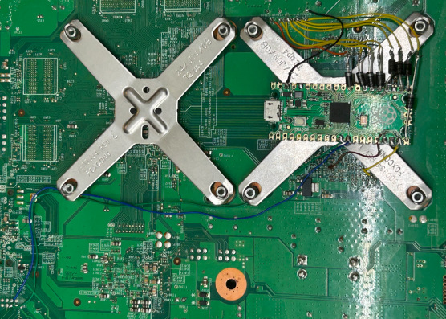

# pigli360 - Experimental/research RGH stuff for Raspberry Pi Pico

Yeah.

## A helpful note

Nothing in here is intended to be used for serious RGH installations.
The code is buggy and kinda shitty and although it might work or not, it's definitely
more experimental than anything you'd want to use.

Other people have managed to produce RGH1.2 implementations on RP2040, so if you want
to make a RP2040-based glitcher, go looking for those.

## Roadmap/wishlist

Common phat modding methods:
- RGH1.2: Done, tested working on Falcon, not sure how it will work on Jasper yet
- EXT_CLK: Doesn't work. EXT_CLK uses far less precise slowdown than PLL (maybe 3-11x slowdown) and as such
  requires more accurate timings. Some way of getting the RP2040 to run off the 48 MHz system standby
  clock will be required, most likely using a high speed 74-series counter IC.

Novel concepts for glitching:
- RGH1.3: RGH1.2 but with a RGH3-like image. Boots to XeLL in 5 seconds on Falcons. Questionable if it's any
  real improvement over RGH1.2. Use XeLL images in `ecc/` to run this.
- RGH1.2.3: Basically RGH1.2 with I2C slowdown and RGH3 ECC. Not working; CPU crashes at 0x22 every time.
- EXT+3: Similar concept for Zephyr boards combining EXT_CLK and I2C slowdown. Might be unstable.

Other stuff I could conceptualize:
- Method to use I2C to disable the 100 MHz CPU clock and inject a slower clock signal in its place.
  Should be far more effective than EXT_CLK. Likely impossible without a properly temperature compensated
  external clock generator.
- Reset glitch attack against the bootrom. All RGH attacks target CB, but none so far have
  targeted the signature check in the bootrom. Given the 360 has been out for 20 years I'm not
  getting my hopes up for this one.
- Power glitch hack against Winchester boards. Setup would likely need to be timed on Corona and
  monitor NAND accesses, as the Oban CGPU doesn't output POST data. Slowdown would be accomplished
  by I2C slowdown or a manual clock override. Will be dangerous (latchup inside the CGPU a major
  concern here) and probably not reliable.
- Combined EXT_CLK and PLL slowdown: Not possible. If both lines are asserted at the same time then
  CPU_EXT_CLK wins and CPU_PLL_BYPASS is ignored.

And, of course, the thing we all want:
- RSA-2048 private key for the CB images so we don't have to do all this crap.

## So why try doing this?

RGH3 can be slow on phats and tends to be super unreliable on Jaspers. Meanwhile,
RGH1.2 requires a modchip that, while it's able to work more precisely, still has
shortcomings. And still sucks on Jaspers.

Glitch chips are mainly based around an outdated and almost certainly end-of-life Xilinx
FPGA, and they tend to cost a lot more than what a hypothetical modern solution would.
They also don't monitor the full POST bus, so when a boot fails, the glitch chip is forced
to sit around drooling like an idiot before the SMC gives up and reboots the system.

Also I wanted to write this implementation in Micropython to show that you can write a working
RGH implementation in slow ass software. RGH3 demonstrated that software-based glitching is
viable, and it's quite possible that someone could launch a successful attack on a modern 48 MHz
Cortex microcontroller, no FPGA required. So yeah, this is just a shitpost version of RGH.

## Further reading

These are essential reading for anyone interested in 360 modding.

- [GliGli's writeup on RGH1 and RGH2](https://free60.org/Hacks/Reset_Glitch_Hack/)
- [15432's writeup on RGH3](https://swarm.ptsecurity.com/xbox-360-security-in-details-the-long-way-to-rgh3/)

## License

Public domain